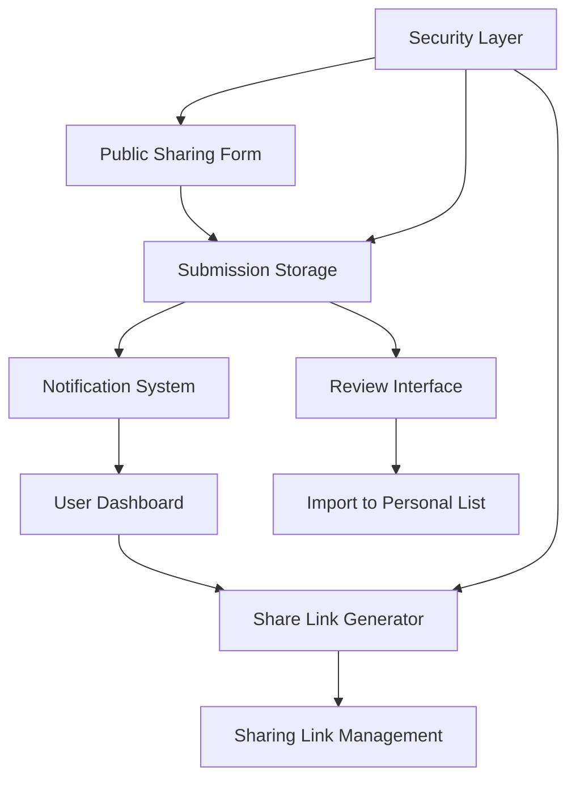

# Birthday Sharing Feature Design

## Overview

The birthday sharing feature enables Lazy Uncle users to generate shareable links that allow friends and family to contribute birthday information. This collaborative approach streamlines birthday collection while maintaining user control over what gets imported into their personal birthday list.

The feature integrates with the existing Lazy Uncle architecture, leveraging the current Prisma/PostgreSQL database, GraphQL API, and Better Auth authentication system. The design emphasizes security, user experience, and seamless integration with existing birthday management workflows.

## Architecture

### High-Level Architecture



### Database Design

The feature extends the existing database schema with three new models:

**SharingLink Model:**

- Stores generated sharing links with expiration and security tokens
- Links to the user who created the link
- Tracks creation, expiration, and usage statistics

**BirthdaySubmission Model:**

- Stores birthday submissions from external contributors
- Contains all submitted birthday data plus metadata
- Links to the sharing link used for submission
- Tracks submission status (pending, imported, rejected)

**NotificationPreference Model:**

- Stores user preferences for sharing notifications
- Configurable notification types and delivery methods

### API Design

The feature extends the existing GraphQL API with new queries and mutations:

**Sharing Link Operations:**

- `createSharingLink`: Generate new sharing links
- `getSharingLinks`: Retrieve user's active sharing links
- `revokeSharingLink`: Deactivate sharing links
- `updateSharingSettings`: Modify sharing preferences

**Submission Operations:**

- `submitBirthday`: Public endpoint for birthday submissions
- `getPendingSubmissions`: Retrieve submissions awaiting review
- `importSubmission`: Import submission to personal birthday list
- `rejectSubmission`: Dismiss submission without importing

## Components and Interfaces

### Frontend Components

**SharingLinkManager Component:**

- Displays active sharing links with creation dates and expiration times
- Provides link generation, copying, and revocation functionality
- Integrates with existing UI patterns and styling

**BirthdaySubmissionForm Component:**

- Public-facing form for birthday submissions
- Validates input data and provides user feedback
- Handles expired link scenarios gracefully

**SubmissionReviewInterface Component:**

- Dashboard for reviewing pending birthday submissions
- Bulk import/reject capabilities
- Duplicate detection and resolution

**SharingSettingsPanel Component:**

- Configuration interface for sharing preferences
- Notification settings and link expiration options
- Integration with existing settings UI

### Backend Interfaces

**SharingService:**

- Handles sharing link generation and validation
- Implements security measures and rate limiting
- Manages link expiration and cleanup

**SubmissionService:**

- Processes birthday submissions and validation
- Handles duplicate detection and data sanitization
- Manages submission lifecycle (pending → imported/rejected)

**NotificationService:**

- Sends notifications for new submissions
- Configurable notification preferences
- Integration with existing notification infrastructure

## Data Models

### Database Schema Extensions

```prisma
model SharingLink {
  id          String   @id @default(cuid())
  token       String   @unique
  userId      String
  createdAt   DateTime @default(now())
  expiresAt   DateTime
  isActive    Boolean  @default(true)
  description String?

  user        User     @relation(fields: [userId], references: [id])
  submissions BirthdaySubmission[]

  @@index([userId])
  @@index([token])
}

model BirthdaySubmission {
  id             String      @id @default(cuid())
  sharingLinkId  String
  name           String
  date           String
  category       String?
  notes          String?     @db.Text
  submitterName  String?
  submitterEmail String?
  relationship   String?
  status         SubmissionStatus @default(PENDING)
  createdAt      DateTime    @default(now())

  sharingLink    SharingLink @relation(fields: [sharingLinkId], references: [id])

  @@index([sharingLinkId])
  @@index([status])
}

model NotificationPreference {
  id                    String  @id @default(cuid())
  userId                String  @unique
  emailNotifications    Boolean @default(true)
  summaryNotifications  Boolean @default(false)

  user                  User    @relation(fields: [userId], references: [id])
}

enum SubmissionStatus {
  PENDING
  IMPORTED
  REJECTED
}
```

### GraphQL Schema Extensions

```graphql
type SharingLink {
  id: String!
  token: String!
  createdAt: DateTime!
  expiresAt: DateTime!
  isActive: Boolean!
  description: String
  submissionCount: Int!
}

type BirthdaySubmission {
  id: String!
  name: String!
  date: String!
  category: String
  notes: String
  submitterName: String
  submitterEmail: String
  relationship: String
  status: SubmissionStatus!
  createdAt: DateTime!
}

enum SubmissionStatus {
  PENDING
  IMPORTED
  REJECTED
}
```

## Error Handling

### Client-Side Error Handling

**Link Generation Errors:**

- Network failures during link creation
- Invalid expiration date selections
- Rate limiting exceeded

**Submission Form Errors:**

- Invalid date formats or missing required fields
- Expired or invalid sharing links
- Network connectivity issues during submission

**Review Interface Errors:**

- Failed import operations due to validation errors
- Bulk operation failures with partial success handling

### Server-Side Error Handling

**Security Violations:**

- Rate limiting enforcement with progressive delays
- Invalid token detection and logging
- Suspicious activity pattern recognition

**Data Validation Errors:**

- Input sanitization and validation failures
- Database constraint violations
- Duplicate detection edge cases

**System Errors:**

- Database connectivity issues
- Email notification delivery failures
- Background job processing errors

## Testing Strategy

### Unit Testing

**Service Layer Testing:**

- SharingService: Link generation, validation, and expiration logic
- SubmissionService: Data processing, validation, and duplicate detection
- NotificationService: Notification delivery and preference handling

**Component Testing:**

- Form validation and user interaction flows
- Error state handling and user feedback
- Integration with existing UI components

### Integration Testing

**API Testing:**

- GraphQL mutation and query operations
- Authentication and authorization flows
- Rate limiting and security measures

**Database Testing:**

- Schema migrations and data integrity
- Concurrent access patterns
- Cleanup and expiration processes

### End-to-End Testing

**User Workflows:**

- Complete sharing link creation and usage flow
- Submission review and import process
- Settings configuration and notification delivery

**Security Testing:**

- Token security and expiration handling
- Rate limiting effectiveness
- Input validation and sanitization

## Security Considerations

### Token Security

**Link Generation:**

- Cryptographically secure random token generation using Node.js crypto module
- Minimum token length of 32 characters with URL-safe encoding
- No predictable patterns in token generation

**Token Validation:**

- Constant-time string comparison to prevent timing attacks
- Automatic token invalidation on expiration
- Secure token storage with database indexing

### Rate Limiting

**Submission Rate Limiting:**

- IP-based rate limiting: 10 submissions per hour per IP
- Progressive delays for repeated violations
- Temporary IP blocking for severe abuse

**Link Generation Rate Limiting:**

- User-based limits: 5 active links per user maximum
- Daily generation limits: 3 new links per day per user
- Automatic cleanup of expired links

### Data Validation

**Input Sanitization:**

- HTML entity encoding for all text inputs
- Date format validation and normalization
- Email format validation for optional submitter emails

**SQL Injection Prevention:**

- Parameterized queries through Prisma ORM
- Input validation at GraphQL resolver level
- Type-safe database operations

## Performance Considerations

### Database Optimization

**Indexing Strategy:**

- Composite indexes on frequently queried fields
- Partial indexes for active sharing links
- Regular index maintenance and analysis

**Query Optimization:**

- Efficient pagination for submission lists
- Optimized joins for related data fetching
- Database connection pooling

### Caching Strategy

**Link Validation Caching:**

- Redis cache for frequently accessed sharing links
- 5-minute TTL for link validation results
- Cache invalidation on link status changes

**Submission Data Caching:**

- Temporary caching of submission counts
- Cache warming for user dashboard data
- Efficient cache key strategies

### Background Processing

**Cleanup Operations:**

- Daily cleanup of expired sharing links
- Weekly cleanup of old rejected submissions
- Automated database maintenance tasks

**Notification Processing:**

- Asynchronous notification delivery
- Retry mechanisms for failed notifications
- Batch processing for summary notifications

## Integration Points

### Existing Birthday Management

**Data Model Compatibility:**

- Seamless integration with existing Birthday model
- Consistent data validation and formatting
- Preservation of existing birthday relationships

**UI Integration:**

- Consistent styling with existing components
- Integration with current navigation patterns
- Responsive design matching existing layouts

### Authentication System

**Better Auth Integration:**

- Leveraging existing user authentication
- Session management for sharing features
- Role-based access control for admin features

### Notification Infrastructure

**Email Integration:**

- Integration with existing email service
- Consistent email templates and branding
- Configurable notification preferences

This design provides a comprehensive foundation for implementing the birthday sharing feature while maintaining security, performance, and seamless integration with the existing Lazy Uncle application.
