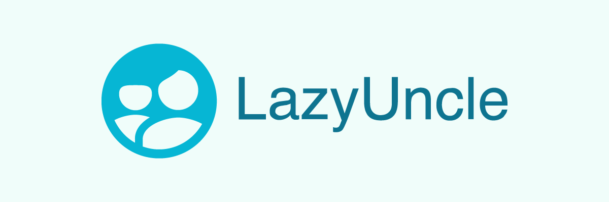

# Lazy Uncle

I just wanted to create a little app to keep track of birthdays. That's pretty much it. You can use the app for free here: [https://www.lazyuncle.net/](https://www.lazyuncle.net/). If you feel like contributing please do. Just fork this repo and send me a PR.

## Core Technologies used

- React
- Next.js
- PlanetScale
- NextAuth
- Prisma
- Apollo client
- Tailwind CSS

## Getting Started

1. Copy the .env.example file to .env
2. Set up your MongoDB Atlas instance. Grab the connection string and put it in the .env
3. Set up your GitHub app or Google app using these instructions
   - Github: [httpshttps://www.better-auth.com/docs/authentication/github]()
   - Google: [httpshttps://www.better-auth.com/docs/authentication/google]()
4. Run the dev server `npm run dev`
5. Open [http://localhost:3000](http://localhost:3000) with your browser to see the result.

## Important files

- `pages/graphql.ts`: All GraphQL requests hit this endpoint. Visit [http://localhost:3000/api/graphql]() to open the Apollo Studio
- `prisma/schema.prisma`: All database schemas must be implemented here
